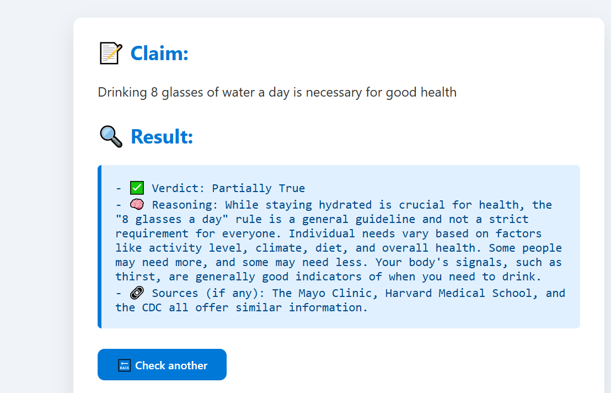
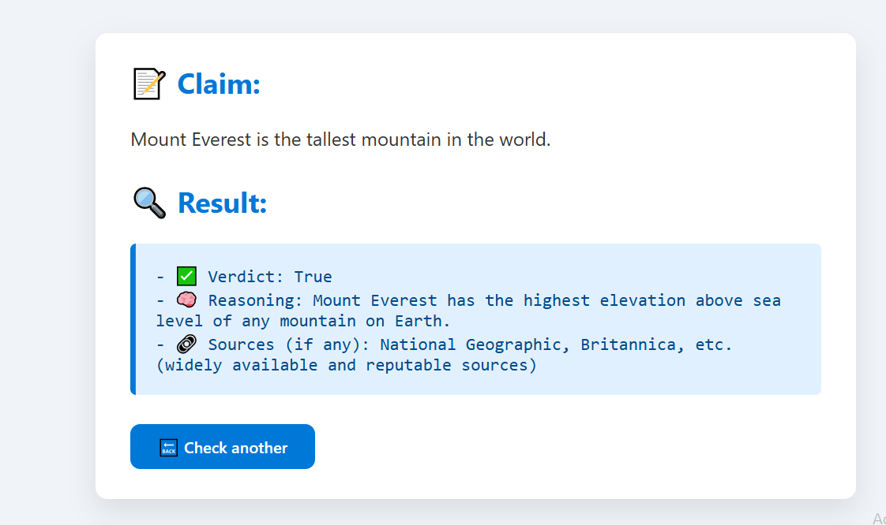

# 🧠 FactCheckBuddy

**FactCheckBuddy** is a lightweight web app that allows users to verify the accuracy of any claim using Google's Gemini AI. Just enter a claim, and the app returns:

- ✅ A clear verdict (True / False / Partially True)
- 💬 A short explanation (reasoning)
- 🔗 Optional credible sources (if available)

---

## 🚀 Features

- ✅ **Verdict**: Tells whether a claim is True, False, or Partially True.
- 💬 **Reasoning**: Explains why the claim is evaluated that way.
- 🔗 **Sources**: Trusted source links or names (like WHO, CDC, etc.).
- 🛠️ Easy to use through a web interface (built with Flask).

---

## 🖼️ Screenshots

Here are a few examples of FactCheckBuddy in action:




---

## ⚙️ Tech Stack

- **Frontend**: HTML + CSS (Flask templates)
- **Backend**: Python (Flask)
- **Model**: Google Gemini (`gemini-2.0-flash-lite-001`)

---

## 🛠️ Setup Instructions

### 1. Clone the Repository

```bash
git clone https://github.com/manisang89/FactCheckBuddy.git
cd FactCheckBuddy
```

### 2. Install Python Dependencies
```bash
pip install -r requirements.txt
```

### 3. Create a gemini api key
In the root of the project, create a file named .env and paste this line
```bash
GEMINI_API_KEY=your_generated_api_key_here
```
